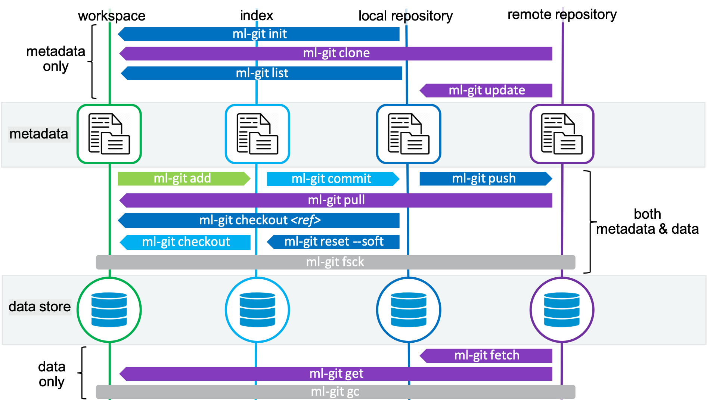

# ml-git : a Distributed Version Control System for  #

ml-git documentation:
* [Your first ML artefacts under ml-git management](docs/first_project.md)
* [Quick start](docs/quick_start.md)
* [ml-git commands documentation](docs/mlgit_commands.md)
* [Architecture & Internals of ml-git](docs/mlgit_internals.md)
* [S3 bucket configuration](docs/s3_configurations.md)
* [Info for ml-git Developers/Maintainers](docs/developer_info.md)
* [Centralized Cache/Objects configuration](docs/centralized_cache_and_objects.md)
* [ml-git API](docs/mlgit_api.md)

## Context ##

One of the major  engineer challenge is to create projects enabling efficient collaboration from anyone within a team, across teams or across organizations.
A few questions to ask :
* How do you distribute your datasets & labels? How do you evolve these datasets?
* How do you list the available ML datasets & labels?
* How do you version a ML model?
* How do you exactly reproduce a specific ML model version?

Compared to legacy SW development, the challenge comes from 2 main reasons:
1. VCS are usually not made to keep versioning of a high number (~Millions) of - sometimes large - binary files
2. it's not a simple code/text -> binary relationship. There is a more complex relationship between a set of, let's call them, ML entities, as shown in Figure 1. Even though Figure 1. is not complete, it already shows a pretty good picture of  entities relationships.

|  |
|:--:|
| *Figure 1. ML entities* |

If one does not track exactly the version of a dataset, nobody will be able to reproduce a specific version of a ML model ... unless, the dataset is kept static/immutable. Unlikely to be a desirable property of a dataset in a  world.
If one cannot relate a label set to a specific dataset version, you end with the same constraints.

Today, it is so cumbersome to do these kind of dataset updates that most of public datasets are almost static. With the most active being updated once a year. Furthermore, since there is no version tracking system behind, there is no way for anyone to send, say, a pull request with new data. This is not a situation the worldwide  community wants to stay in.

## ml-git purpose ##

ml-git is a tool which aim is to provide a Distributed Version Control system to enable efficient  engineers collaboration. Like its name emphasizes, it is meant to be similar to git in mindset, concept and workflows.
More specifically, it should enable  engineers to
* manage a repository of different datasets, labels and models,
* version  engineers ML artefacts (dataset, labels, ...),
* distribute these ML artefacts between members of a team or across organizations,
* apply the right data governance and security models to their artefacts.

If done right, we should not only enable  engineers track versioning of ML entities (dataset, labels, ...), but also reproduce any experiment **and** enable easy updates of any (public) datasets.

In a nutshell, ml-git operates at the level of a project and within a project on specific ML entities (dataset, labels, ...).
For each of these ML entities, the workflow of meta-/data transport commands follows to the ones described in Figure 2.

|  |
|:--:|
| *Figure 2. ml-git meta-/data transport commands* |

## Setup and usage Guide ##


### Prerequisites ###
- [Git](https://git-scm.com/book/en/v2/Getting-Started-Installing-Git).

### Quick setup ###

Download ml-git repository:
```
$ git clone 
```

Install ml-git
```
$ cd ml-git/
$ python setup.py install
```

As ml-git leverages git to manage ML entities metadata, it is necessary to configure user name and email address:
```
$ git config --global user.name "Sébastien Tandel"
$ git config --global user.email "sebastien.tandel@hp.com"
```

### ml-git usage ###
```
$ ml-git --help
Usage: ml-git [OPTIONS] COMMAND [ARGS]...

Options:
   --version  Show the version and exit.

Commands:
  clone       clone a ml-git repository ML_GIT_REPOSITORY_URL
  dataset     management of datasets within this ml-git repository
  labels      management of labels sets within this ml-git repository
  model       management of models within this ml-git repository
  repository  management of this ml-git repository
```

