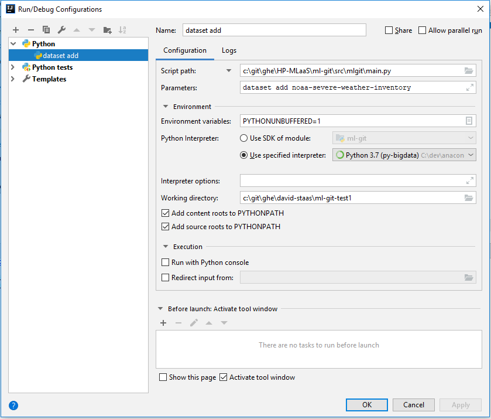

# Info for ml-git Developers


# Unit Tests

## Configuring Your System for Unit Tests

You may set the following environment variables before running the unit tests:
```
MLGIT_TEST_BUCKET
MLGIT_TEST_PROFILE
MLGIT_TEST_REGION

Example:

MLGIT_TEST_BUCKET=dstaas-datasets
MLGIT_TEST_PROFILE=default
MLGIT_TEST_REGION=us-west-2
```

If not set, the values will default to 'mlgit-datasets' and 'mlgit-data-models' for bucket depending on the test case.
Region will default to 'us-east-1' and profile will default to 'personal'.

If you get an error about coverage, you'll need to install coverage support:

```
conda install coverage
or
pip install coverage (for non-Conda environments)
```

## Running Tests

```
cd test
sh run_tests.sh (Linux), or
run_tests.bat (Windows)
```

## Examining Code Coverage

After running tests via the method above, you can do:

```
coverage html
cd htmlcov
index.html (to open index.html in a browser)
```
You can then look at the lines that aren't covered and devise tests for them.

# Developing on Windows

So far this seems to work fine.  The unit tests have been updated to run correctly on Windows.  There is 
now a ```run_tests.bat``` at the root of the 'test' directory.


# IntelliJ IDEA Configuration

- First, install the Python plugin.  It's very similar to PyCharm and works well if you have the full license for
IntelliJ IDEA.

## Using Anaconda As Your Windows Python Environment

[Anaconda](https://anaconda.org/) is a good way to get a Python development environment installed on your Windows
machine.  However, there are a couple things to note.  

If you're using Anaconda, you can configure IntelliJ with a Python SDK that points to it.

- Install Anaconda in some location (e.g. ```c:\dev\anaconda```)
- File - Project Structure...
  - Platform Settings Project SDKs
  - '+' button at the top to add a new SDK
  - Python SDK
  - Select 'Conda Environment' on the left & fill in the details 
  
If you have an existing Anaconda environment, you can point to it here.

Note that if you're in IntelliJ and you're missing an import that Conda can't import, you can still do pip install
from the command line, but be sure to activate the same Anaconda environment first before doing so, e.g.

```$xslt
(From an Anaconda command window:)
activate py-bigdata (or whatever your normal Anaconda working env name is)
pip install py-cid
pip-install my-multihash
```

In this way, the imports will be available through IntelliJ if you're using that same environment.

## Setting Up Unit Testing in IntelliJ

ml-git uses [nose](https://nose.readthedocs.io/en/latest/) as its test runner.  You can configure IntelliJ for
nose here:

- Settings - Tools - Python Integrated Tools - Testing - Default test runner: Nosetests

This allows you to run unit tests directly from within IntelliJ and use the debugger.

## Running and Debugging from IntelliJ

Set up a Run Configuration that looks like this:



Replace 'Parameters' with the command you want to debug.  Replace the working directory as appropriate for your system.