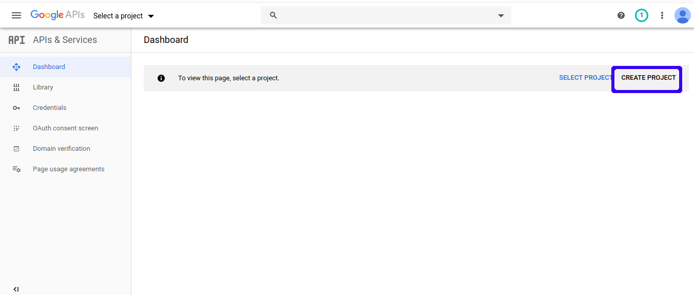
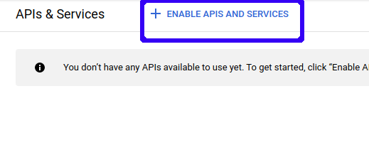
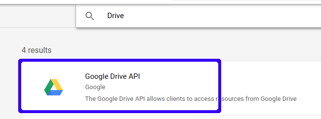
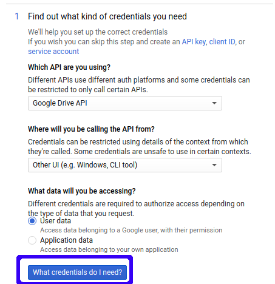
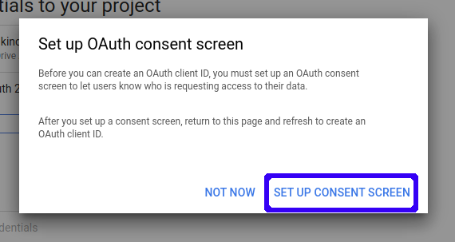
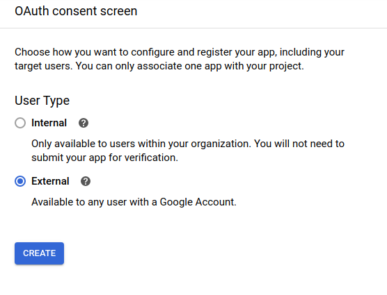
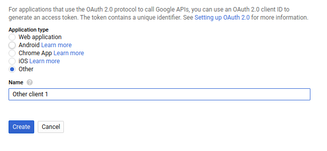
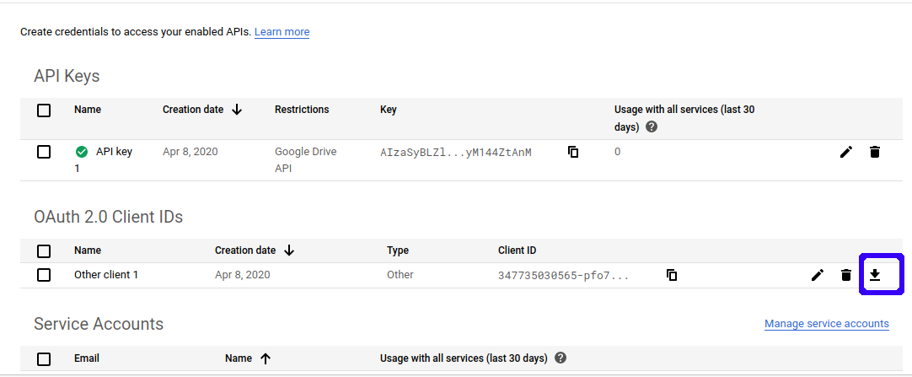

# Google Drive API configuration

This section aims to explain how to enable Google Drive API and configure OAuth 2.0 credentials to use with ML-Git.

#### Enabling Drive API

You need to create a project in Google developer console to activate Drive API, follow instructions bellow:

**1. Access [console developer](https://console.developers.google.com/) and click on create project:**



**2. Then type name of your preference and click on "CREATE" button:**


**3. Go back to dashboard and enable Drive API:**




**4. Search for Drive API on search bar:**




#### Creating credentials

When you finish Enabling API step, you need to create your credentials and configure authentication consent screen.

**1. Click on create credentials:**






**2. Select user type of your consent:**



**3. Add application name to authentication consent screen:**


**4. Change application's scope if you prefer and save:**


**5. Go back to dashboard and click on create credentials and generate your API KEY:**


**6. Generate OAuth client id:**


**7. Add client name and select application type:**



**8. Finally you can download your credentials file:**



# Setting up a ML-Git project with Google Drive #

Create directory with name  of your preference and copy your credentials  file with name **credentials.json** inside the directory.

Add storage configurations example:

```
$ ml-git repository storage add path-in-your-drive --type=gdriveh --credentials=/home/profile/.gdrive
```

After that initialize the metadata repository:

```
$ ml-git datasets init
```


We strongly recommend that you add `push_threads_count: 10` option in your .**ml-git/config.yaml**, because of Google Drive API request limit of 10/s. This option change the number of workers used in multithreading push process, by default the number of workers is cpu numbers multiplied by 5. 

The push command was tested with 10 workers and the request limit was not exceeded.

Configuration example:

```
batch_size: 20
push_threads_count: 10
datasets:
  git: ''
labels:
  git: ''
models:
  git: ''
storages:
  gdriveh:
    dataset-gdrive:
      credentials-path: /home/profile/.gdrive
```

